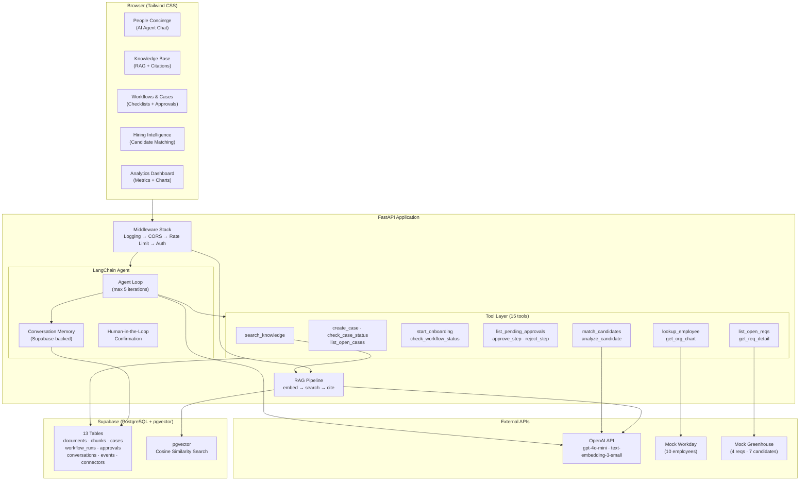

# People Help — Architecture & Design

> An AI-powered Employee Experience platform that demonstrates how agentic AI, retrieval-augmented generation, and workflow orchestration can transform People Technology.

---

## 1. Problem Statement

HR teams at scale face a fragmented tooling landscape: employees navigate multiple systems (HRIS, ATS, ticketing, knowledge bases) to get answers, start processes, or resolve issues. This leads to:

- **High case volume** — Simple questions that could be self-served
- **Slow onboarding** — Manual checklists and approval chains
- **Disconnected data** — Employee info in Workday, candidates in Greenhouse, policies in Confluence
- **No intelligence layer** — Hiring decisions lack data-driven scoring

**People Help** is a unified AI layer that sits on top of these systems, providing a single conversational interface for employees and an orchestration backbone for HR teams.

---

## 2. System Architecture

```
┌──────────────────────────────────────────────────────────────────┐
│                         Browser (Tailwind CSS)                    │
│  ┌────────────┐  ┌──────────┐  ┌──────────┐  ┌───────────────┐  │
│  │ Concierge  │  │ Knowledge│  │Workflows │  │  Analytics    │  │
│  │ (AI Agent) │  │   Base   │  │ & Cases  │  │  Dashboard    │  │
│  └─────┬──────┘  └────┬─────┘  └────┬─────┘  └───────┬───────┘  │
└────────┼───────────────┼────────────┼─────────────────┼──────────┘
         │               │            │                 │
    ┌────▼───────────────▼────────────▼─────────────────▼──────┐
    │                    FastAPI Application                     │
    │  ┌─────────────────────────────────────────────────────┐  │
    │  │              Middleware Stack                         │  │
    │  │  Request Logging → CORS → Rate Limiting → API Auth   │  │
    │  └─────────────────────────────────────────────────────┘  │
    │                                                           │
    │  ┌──────────────────────┐  ┌───────────────────────────┐  │
    │  │   LangChain Agent    │  │     RAG Pipeline          │  │
    │  │   (15 tools)         │  │  embed → search → cite    │  │
    │  │   + memory           │  │  (pgvector similarity)    │  │
    │  │   + human-in-loop    │  └───────────────────────────┘  │
    │  └──────────┬───────────┘                                 │
    │             │                                             │
    │  ┌──────────▼───────────────────────────────────────────┐ │
    │  │                  Tool Layer                           │ │
    │  │  Knowledge │ Cases │ Workflows │ Approvals │ Hiring  │ │
    │  │  Workday   │ Greenhouse │ Org Chart │ Candidates     │ │
    │  └──────────────────────────┬────────────────────────────┘ │
    └─────────────────────────────┼────────────────────────────┘
                                  │
    ┌─────────────────────────────▼────────────────────────────┐
    │                  Supabase (PostgreSQL + pgvector)          │
    │  13 tables: documents, chunks, questions, feedback,       │
    │  cases, workflow_runs, checklist, approvals, events,      │
    │  conversations, messages, connectors, definitions         │
    └──────────────────────────────────────────────────────────┘
                                  │
    ┌─────────────────────────────▼────────────────────────────┐
    │                     OpenAI API                            │
    │  text-embedding-3-small (RAG + candidate matching)        │
    │  gpt-4o-mini (agent reasoning + candidate analysis)       │
    └──────────────────────────────────────────────────────────┘
```

<details>
<summary><strong>Interactive diagram</strong> (click to expand — GitHub renders this as a live flowchart)</summary>



</details>

---

## 3. Agent Design

The People Concierge uses a **LangChain agent** with 15 tools, conversation memory, and human-in-the-loop confirmation for destructive actions.

### Tool Inventory

| Category | Tool | Purpose |
|----------|------|---------|
| **Knowledge** | `search_knowledge` | RAG search over 7 HR policy documents |
| **Cases** | `create_case` | Create support ticket (requires user confirmation) |
| | `check_case_status` | Look up case by ID |
| | `list_open_cases` | Show all open support cases |
| **Workflows** | `start_onboarding` | Create onboarding run with duplicate detection |
| | `check_workflow_status` | Show checklist progress and approval state |
| **Approvals** | `list_pending_approvals` | Show actionable approval steps |
| | `approve_step` | Approve (requires confirmation) |
| | `reject_step` | Reject with notes (requires confirmation) |
| **Workday** | `lookup_employee` | Search by name, email, or ID |
| | `get_org_chart` | Manager chain + direct reports |
| **Greenhouse** | `list_open_reqs` | Open requisitions |
| | `get_req_detail` | Requisition + candidate pipeline |
| **Intelligence** | `match_candidates` | AI-ranked candidates by embedding similarity |
| | `analyze_candidate` | Strengths, gaps, recommendation via LLM |

### Agent Loop

```
User message
  → Load conversation history (Supabase)
  → [SystemPrompt + History + User] → LLM
  → If tool_calls:
      → Execute tools (max 5 iterations)
      → Append tool results
      → Re-invoke LLM
  → Final response → Save to history → Return
```

### Key Behaviors

- **Human-in-the-loop**: The system prompt instructs the agent to ask for confirmation before creating cases, starting workflows, or processing approvals
- **Duplicate detection**: Before creating an onboarding run, the agent checks for existing active runs with a similar name and warns the user
- **Citation**: When using knowledge base results, the agent cites source numbers [1], [2], etc.
- **Graceful fallback**: If the knowledge base has no relevant results, the agent honestly says so and suggests contacting HR directly

---

## 4. Data Model

### Core Tables (13)

| Table | Purpose | Key Fields |
|-------|---------|------------|
| `documents` | Source HR policy docs | title, content |
| `document_chunks` | Chunked text with embeddings | content, embedding (vector 1536), document_id |
| `questions` | Logged KB questions | query, answer_text, sources_json |
| `feedback` | Helpful/not helpful | question_id, helpful (boolean) |
| `cases` | Support tickets | subject, description, status |
| `workflow_runs` | Onboarding instances | workflow_type, status, payload (trigger name) |
| `workflow_checklist` | Checklist items per run | label, done, sort_order |
| `workflow_definitions` | Configurable step templates | name, definition (JSON steps) |
| `approvals` | Approval steps per run | step_name, step_order, approver_role, status |
| `conversations` | Chat sessions | created_at |
| `conversation_messages` | Chat turns | role, content, conversation_id |
| `events` | System audit trail | event_type, payload (JSON) |
| `connectors` | Integration health | name, type, status, last_event_at |

### RAG Pipeline

```
Ingest: Document → chunk (500 char paragraphs) → embed (text-embedding-3-small) → store in pgvector
Query:  User question → embed → cosine similarity search (top 5) → LLM synthesizes answer with citations
```

---

## 5. Seed Data System

A single `npm run seed` command resets all tables and populates realistic demo data:

| Data Type | Count | Details |
|-----------|-------|---------|
| KB Documents | 7 | PTO, expenses, onboarding, hiring, interviews, compensation, performance reviews |
| Workflow Definitions | 3 | Onboarding (3 steps), PTO request (2 steps), expense reimbursement (2 steps) |
| Connectors | 4 | Workday (connected), Greenhouse (connected), Slack (connected), Okta (not configured) |
| Support Cases | 8 | 5 open, 3 resolved — direct deposit, laptop, benefits, VPN, org chart, PTO, expenses, ergonomic |
| Onboarding Runs | 5 | Jamie Lee (in-progress, 2/4 done), Priya Sharma (completed), Marcus Chen (just started), Sofia Rodriguez (completed, 45d ago), Aiden Park (brand new) |
| Events | 20+ | offer_accepted, case_created, approval_approved, webhook_received |
| KB Feedback | 10 | 8 helpful, 2 not helpful — populates analytics charts |

---

## 6. Security & Hardening

| Layer | Implementation |
|-------|---------------|
| **Authentication** | API key middleware on API endpoints; UI pages public for demo |
| **Rate Limiting** | Per-IP sliding window on LLM endpoints (configurable, default 20/min) |
| **Input Validation** | Pydantic models on all API endpoints |
| **Logging** | Structured request logging with unique request IDs |
| **CORS** | Configured for local development origins |
| **Tests** | 84 tests across 6 files (API, integrations, RAG, models, middleware, candidate intelligence) |

---

## 7. Production Roadmap

If evolving People Help from demo to production:

| Priority | Initiative | Rationale |
|----------|-----------|-----------|
| **P0** | **LangGraph migration** | Replace LangChain `AgentExecutor` with LangGraph for explicit state machine control, human-in-the-loop as graph nodes, parallel tool execution, and better error recovery |
| **P0** | **Authentication & RBAC** | SSO integration (Okta/Azure AD), role-based access (employee, manager, HR admin, IT). Gate approval actions and admin views |
| **P1** | **Real integrations** | Replace mock Workday/Greenhouse with OAuth-based connectors. Add Slack (notifications), Okta (identity), email (case updates) |
| **P1** | **Streaming responses** | SSE streaming for People Concierge to reduce perceived latency from 3-5s to instant first-token |
| **P2** | **Observability** | LangSmith or LangFuse for agent tracing. Datadog/New Relic for APM. Structured metrics for tool usage, latency, error rates |
| **P2** | **Knowledge management** | Admin UI for uploading/managing policy docs. Versioning, approval workflow for content changes |
| **P3** | **Multi-tenant** | Org-scoped data, tenant isolation, per-org config for workflows and integrations |
| **P3** | **Mobile** | Responsive design or dedicated mobile experience for on-the-go HR queries |

---

## 8. Technology Choices

| Layer | Choice | Rationale |
|-------|--------|-----------|
| **App Framework** | FastAPI | Async-native, auto-generated OpenAPI docs, Pydantic integration |
| **Database** | Supabase (PostgreSQL + pgvector) | Managed Postgres with vector search, REST API, real-time subscriptions |
| **LLM** | OpenAI (gpt-4o-mini) | Best cost/quality ratio for tool-calling agents |
| **Embeddings** | text-embedding-3-small | 1536-dim, good quality, low cost |
| **Agent Framework** | LangChain | Rapid prototyping with tool abstractions; planned migration to LangGraph |
| **UI** | Jinja2 + Tailwind CSS | Server-rendered for simplicity; CDN Tailwind for rapid styling |
| **Charts** | Chart.js | Lightweight, no build step required |
| **Deploy** | Render | One-click deploy from GitHub, `render.yaml` included |
