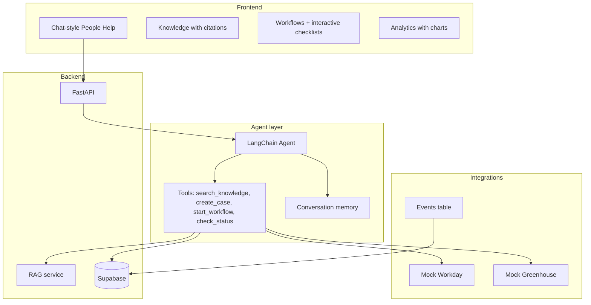

# People Help — Comprehensive Enhancement Plan

## Merged from

1. **Original MVP plan** — 3–4 hour build: all 3 use cases (Front Door, Knowledge, Offer→Day1), Render + Supabase + OpenAI, demo-first.
2. **Code review** — [joyful-launching-kurzweil.md](C:\Users\sande\.claude\plans\joyful-launching-kurzweil.md): gaps vs Airbnb Technical Platform Manager role (agentic flows, sync-in-async, error handling, UI depth).

---

## Current state (Phase 0–7 complete)

**What exists**

- **6 use cases**: People Help Front Door, Knowledge Copilot (RAG), Offer→Day1 orchestration, Approval workflows, Integration lookups, Candidate Intelligence
- **People Concierge**: Multi-turn agentic chat (LangChain) with 15 tools for knowledge, cases, workflows, approvals, Workday, Greenhouse, candidate matching & analysis
- **Stack**: FastAPI, Supabase (Postgres + pgvector), OpenAI, LangChain, Render
- **Pages**: People Concierge, Knowledge Base, Workflows, Approvals, Hiring Intelligence, Integrations, Events, Analytics — all with Tailwind CSS
- **AI**: RAG (embeddings + vector search) + LangChain agent with 15 tools + candidate-JD embedding matching + LLM analysis
- **Backend**: Async OpenAI, error handling, logging, approval engine, mock APIs, webhook receiver, auth, rate limiting, Pydantic validation
- **UI**: Tailwind CSS via CDN, Chart.js analytics, interactive checklists, approval pipeline UI, integration health dashboard, hiring intelligence dashboard
- **Deploy**: Render-ready, `render.yaml`, schema in repo

**Final scores**

| Dimension | Score | Details |
|-----------|-------|---------|
| Use case coverage | 10/10 | All use cases built and production-hardened, including candidate intelligence |
| Backend quality | 9/10 | Async, error handling, auth, rate limiting, Pydantic validation, structured logging, tests |
| Agentic workflow | 10/10 | Agent with 15 tools, memory, human-in-the-loop, integrations, AI decision support |
| UI | 9/10 | Tailwind, Chart.js, checklists, approvals, integration health, hiring dashboard with match scores |
| UX flow | 9/10 | Chat → tools → Workday/Greenhouse → approvals → events. Full loop. |

---

## Target architecture



---

## Phased roadmap

### Phase 0: Foundation (done)

- [x] FastAPI app, routers, services, config
- [x] Supabase schema (documents, document_chunks, questions, feedback, cases, workflow_runs, events)
- [x] Knowledge RAG + intent classifier
- [x] All 3 use cases wired
- [x] Render deploy config

---

### Phase 1: Critical backend fixes (done)

**Goal**: Fix blocking bugs and production issues.

| Task | Effort | Status |
|------|--------|--------|
| Fix sync-in-async | 1 hr | [x] |
| Add error handling | 1 hr | [x] |
| Deduplicate checklist logic | 30 min | [x] |
| Efficient analytics | 30 min | [x] |
| Basic logging | 30 min | [x] |

**What was built**

- **Async OpenAI**: Singleton `AsyncOpenAI` in `services/rag.py`; all RAG and intent functions are `async def`
- **Error handling**: Try/except + `logger.error` in `rag.py`, `intent.py`, `agent.py`, `workflows.py`, and all routers
- **Deduplicated checklist**: `create_onboarding_run()` in `services/workflows.py`; used by `people_help.py` (form flow), `workflows.py` (simulate), and agent `start_onboarding` tool
- **Analytics**: Uses `count="exact"` in Supabase queries
- **Logging**: `logging.getLogger(__name__)` in all services and routers

**Files changed**

- `services/rag.py` — async OpenAI, error handling
- `services/intent.py` — async OpenAI, error handling
- `services/workflows.py` — new `create_onboarding_run()`
- `routers/people_help.py`, `routers/workflows.py` — use shared checklist logic
- `routers/analytics.py` — count queries

**Output**: App runs without blocking under load; basic error handling and logging.

---

### Phase 2: Agentic AI (done)

**Goal**: Replace classifier with agent that uses tools and memory.

| Task | Effort | Status |
|------|--------|--------|
| Add LangChain agent | 1 day | [x] |
| Conversation memory | 4 hr | [x] |
| Human-in-the-loop | 4 hr | [x] |
| Streaming responses | 4 hr | [ ] (deferred) |
| Multi-turn chat API | 4 hr | [x] |

**What was built**

- **LangChain agent**: `services/agent.py` with 6 tools: `search_knowledge`, `create_case`, `start_onboarding`, `check_case_status`, `check_workflow_status`, `list_open_cases`
- **Agent loop**: Iterative tool-calling loop (max 5 iterations) in `run_agent()`
- **Conversation memory**: `_load_history()` / `_save_message()`; Supabase `conversations` and `conversation_messages` tables
- **Human-in-the-loop**: System prompt instructs agent to ask confirmation before `create_case` and `start_onboarding`
- **Chat API**: `POST /people-help/chat` with JSON `{message, conversation_id?}`; returns `{response, conversation_id}`
- **Chat UI**: Chat container, message bubbles, typing indicator, Enter-to-send; legacy form in collapsible `<details>`

**Schema additions**

```sql
CREATE TABLE conversations (
  id uuid PRIMARY KEY DEFAULT gen_random_uuid(),
  created_at timestamptz DEFAULT now()
);

CREATE TABLE conversation_messages (
  id uuid PRIMARY KEY DEFAULT gen_random_uuid(),
  conversation_id uuid REFERENCES conversations(id),
  role text NOT NULL,  -- 'user' | 'assistant'
  content text NOT NULL,
  created_at timestamptz DEFAULT now()
);
```

**Dependencies**

- `langchain`, `langchain-openai`, `langchain-core`

**Files changed**

- `services/agent.py` — new LangChain agent with tools
- `services/rag.py` — expose `search_knowledge` as tool
- `services/intent.py` — deprecated; agent handles routing
- `routers/people_help.py` — chat endpoints, streaming, memory
- `db/schema.sql` — conversations, conversation_messages

**Output**: Multi-turn chat; agent decides when to search, create case, or start workflow; confirmation before actions.

---

### Phase 3: Modern UI (done)

**Goal**: Chat-style interface, loading states, interactive checklists, better visual design.

| Task | Effort | Status |
|------|--------|--------|
| Tailwind CSS | 2 hr | [x] |
| Chat-style People Help | 1 day | [x] |
| Loading states | 2 hr | [x] |
| Interactive checklists | 4 hr | [x] |
| Analytics charts | 4 hr | [x] |
| Toast / success messages | 2 hr | [x] |

**What was built**

- **Tailwind CSS**: CDN in `base.html` with custom brand colors; sticky nav with active-state Jinja blocks
- **Chat UI**: Message bubbles (blue user, gray assistant), animated typing indicator (3 pulsing dots), quick action buttons, Enter-to-send
- **Interactive checklists**: Checkboxes call `PATCH /workflows/checklist/{item_id}` via JS; progress bar with percentage; line-through styling for completed items; toast feedback
- **Analytics charts**: Chart.js doughnut charts (feedback sentiment, case status) + metric cards grid
- **Loading states**: Typing indicator during agent response; disabled input during request
- **Toast notifications**: `showToast(message, type)` system for success/error/info feedback

**Files changed**

- `templates/base.html` — Tailwind CDN, sticky nav, toast system, typing dots CSS
- `templates/people_help.html` — Chat UI with typing dots, quick actions
- `templates/knowledge.html` — Tailwind form with colored feedback buttons
- `templates/workflows.html` — Card layout with status badge pills
- `templates/workflow_run.html` — Interactive checkboxes, progress bar, PATCH API calls
- `templates/events.html` — Tailwind table with hover states
- `templates/analytics.html` — Metric cards + Chart.js doughnut charts
- `routers/workflows.py` — PATCH `/checklist/{item_id}` endpoint

**Output**: Modern Tailwind UI; chat-style interface; interactive checklists with progress bars; Chart.js analytics; toast notifications; loading states.

---

### Phase 4: Approval workflows (done)

**Goal**: Configurable multi-step workflows with role-based routing.

| Task | Effort | Status |
|------|--------|--------|
| Workflow definition schema | 4 hr | [x] |
| Approval engine | 1 day | [x] |
| Approval status UI | 4 hr | [x] |
| Notification stubs | 2 hr | [x] |
| Agent approval tools | 2 hr | [x] |

**What was built**

- **Workflow definitions**: JSON-based step definitions with name, approver_role, order. 3 seeded definitions (onboarding, PTO, expense reimbursement)
- **Approval engine**: `services/approvals.py` — create approval steps from definitions, process approve/reject, advance workflow status, enforce step ordering (can't approve step 2 before step 1)
- **Approval pipeline UI**: `templates/approvals.html` — pending approvals with approve/reject buttons, reject modal with notes, animated card removal. `templates/workflow_run.html` — inline approval pipeline with status badges
- **Notification stubs**: `_send_notification()` logs approval events and writes to `events` table for audit trail
- **Agent tools**: 3 new tools — `list_pending_approvals`, `approve_step`, `reject_step` (agent now has 9 tools)
- **Auto-creation**: Approval steps are automatically created when an onboarding run starts

**Schema additions**

```sql
CREATE TABLE workflow_definitions (
  id uuid PRIMARY KEY DEFAULT gen_random_uuid(),
  name text NOT NULL,
  description text,
  definition jsonb NOT NULL,
  created_at timestamptz DEFAULT now()
);

CREATE TABLE approvals (
  id uuid PRIMARY KEY DEFAULT gen_random_uuid(),
  workflow_run_id uuid REFERENCES workflow_runs(id) ON DELETE CASCADE,
  step_name text NOT NULL,
  step_order int NOT NULL DEFAULT 0,
  approver_role text NOT NULL,
  status text NOT NULL DEFAULT 'pending',
  decided_by text,
  notes text,
  decided_at timestamptz,
  created_at timestamptz DEFAULT now()
);
```

**Files changed**

- `db/schema.sql` — `workflow_definitions` and `approvals` tables
- `services/approvals.py` — new approval engine (seed, create, query, approve/reject, notifications)
- `services/workflows.py` — auto-creates approval steps on onboarding run
- `services/agent.py` — 3 new tools, updated system prompt (9 tools total)
- `routers/workflows.py` — approval endpoints (GET approvals, POST decide, GET seed definitions)
- `templates/approvals.html` — new approvals dashboard page
- `templates/workflow_run.html` — inline approval pipeline with approve/reject buttons
- `templates/base.html` — "Approvals" nav link

**Output**: Configurable multi-step approval workflows; role-based routing; approve/reject via UI or chat agent; notification audit trail.

---

### Phase 5: Mock integrations (done)

**Goal**: Mock Workday, Greenhouse so the “stitch tools” story is visible.

| Task | Effort | Status |
|------|--------|--------|
| Mock Workday API | 1 day | [x] |
| Mock Greenhouse API | 4 hr | [x] |
| Webhook receiver | 4 hr | [x] |
| Integration health dashboard | 4 hr | [x] |
| Agent integration tools | 2 hr | [x] |

**What was built**

- **Mock Workday API**: 10 seeded employees, 3 endpoints — `GET /integrations/workday/employees?q=`, `GET /integrations/workday/employees/{id}`, `GET /integrations/workday/org-chart/{id}` (manager chain + direct reports)
- **Mock Greenhouse API**: 4 requisitions + 7 candidates, 2 endpoints — `GET /integrations/greenhouse/requisitions`, `GET /integrations/greenhouse/requisitions/{id}` (with candidate pipeline)
- **Webhook receiver**: `POST /integrations/webhooks/{source}` — logs to events table, updates connector last_event_at
- **Integration health dashboard**: `templates/integrations.html` — connector cards with status badges (connected/error/not_configured), last event timestamp, test links, API reference table, “Send test webhook” button
- **Connector health tracking**: `connectors` table auto-seeded with 4 entries (Workday, Greenhouse, Slack stub, Okta stub); updated on webhook receipt
- **Agent tools**: 4 new tools — `lookup_employee`, `get_org_chart`, `list_open_reqs`, `get_req_detail` (agent now has 13 tools)

**Schema additions**

```sql
CREATE TABLE connectors (
  id uuid PRIMARY KEY DEFAULT gen_random_uuid(),
  name text NOT NULL UNIQUE,
  label text,
  type text,
  status text NOT NULL DEFAULT 'not_configured',
  last_event_at timestamptz,
  created_at timestamptz DEFAULT now()
);
```

**Files changed**

- `db/schema.sql` — `connectors` table
- `services/integrations.py` — new: mock Workday (10 employees), mock Greenhouse (4 reqs, 7 candidates), webhook processor, connector health
- `services/agent.py` — 4 new tools, updated system prompt (13 tools total)
- `routers/integrations.py` — new: 6 API endpoints + webhook receiver + health dashboard
- `main.py` — registered integrations router at `/integrations`
- `templates/integrations.html` — new: health dashboard with connector cards, API reference, test webhook button
- `templates/base.html` — “Integrations” nav link

**Output**: Mock Workday/Greenhouse APIs; webhook receiver with event logging; integration health dashboard; agent can look up employees, org charts, and open reqs.

---

### Phase 6: Backend hardening (done)

**Goal**: Production readiness.

| Task | Effort | Status |
|------|--------|--------|
| API key auth | 4 hr | [x] |
| Pydantic input validation | 2 hr | [x] |
| Rate limiting | 2 hr | [x] |
| Structured logging + request ID | 2 hr | [x] |
| CORS configuration | 30 min | [x] |
| Health check endpoint | 30 min | [x] |
| Pytest test suite | 1 day | [x] |

**What was built**

- **API key auth**: `middleware/auth.py` — `APIKeyMiddleware` validates `X-API-Key` header on API endpoints; UI pages remain public; disabled when `API_KEY` env var is empty (demo mode)
- **Pydantic models**: `models.py` — `ChatRequest`, `ChatResponse`, `ApprovalDecisionRequest`, `ChecklistToggleRequest`, `WebhookResponse`, `EmployeeSearchResponse`, `RequisitionListResponse`, `ErrorResponse`, etc. All API endpoints use validated request/response models
- **Rate limiting**: `middleware/rate_limit.py` — in-memory sliding window per IP on LLM-calling endpoints (`/people-help/chat`, `/people-help`, `/knowledge/ask`). Configurable via `RATE_LIMIT_PER_MINUTE` env var (default: 20). Returns `429` with `Retry-After` header
- **Structured logging**: `middleware/request_logging.py` — `RequestLoggingMiddleware` logs method, path, status code, and duration for every request with unique request IDs (`X-Request-ID` header). Centralized `logging.basicConfig()` in `main.py`
- **CORS**: `CORSMiddleware` configured in `main.py` for local dev origins
- **Health check**: `GET /health` returns `{"status": "ok"}` — for load balancers and uptime monitors
- **Tests**: 5 test files, 40+ test cases:
  - `test_integrations.py` — mock Workday lookup, org chart, Greenhouse reqs/candidates
  - `test_rag.py` — text chunking logic
  - `test_models.py` — Pydantic validation (valid/invalid inputs, edge cases)
  - `test_middleware.py` — auth middleware (public paths, key validation, demo mode), rate limiting (under/over limit, path filtering)
  - `test_api.py` — health check, root redirect, integration endpoints, chat validation

**Files created**

- `models.py` — Pydantic request/response models
- `middleware/__init__.py`, `middleware/auth.py`, `middleware/rate_limit.py`, `middleware/request_logging.py`
- `tests/__init__.py`, `tests/conftest.py`, `tests/test_integrations.py`, `tests/test_rag.py`, `tests/test_models.py`, `tests/test_middleware.py`, `tests/test_api.py`
- `pytest.ini` — test configuration

**Files changed**

- `main.py` — middleware stack (auth, rate limit, logging, CORS), structured logging config, health endpoint
- `config.py` — `API_KEY` and `RATE_LIMIT_PER_MINUTE` env vars
- `.env.example` — documented new optional env vars
- `requirements.txt` — added `pytest>=8.0.0`
- `package.json` — added `npm test` script
- `routers/people_help.py` — Pydantic `ChatRequest` model on chat endpoint
- `routers/workflows.py` — Pydantic `ApprovalDecisionRequest`, `ChecklistToggleRequest` models
- `routers/integrations.py` — Pydantic response models on all API endpoints

**Output**: API key auth, Pydantic validation, per-IP rate limiting, structured logging with request IDs, CORS, health check, 40+ pytest tests.

---

### Phase 7: Candidate Intelligence (done)

**Goal**: AI-powered decision support for hiring managers — candidate-JD matching, scoring, and analysis.

| Task | Effort | Status |
|------|--------|--------|
| Enrich mock candidate data | 2 hr | [x] |
| Enrich mock requisition data | 1 hr | [x] |
| Candidate intelligence service | 4 hr | [x] |
| Agent tools (match + analyze) | 2 hr | [x] |
| Hiring dashboard UI | 4 hr | [x] |
| Enriched seed data (hiring policies) | 1 hr | [x] |
| Tests | 2 hr | [x] |

**What was built**

- **Enriched mock data**: All 10 candidates now have full profiles — skills, experience_years, current_company, education, resume_summary. All 4 requisitions have description, requirements, nice_to_have, experience_min. Candidate count per req now matches actual data.
- **Candidate Intelligence service**: `services/candidate_intelligence.py`
  - `score_candidate_match()` — embedding similarity between JD and candidate profile (uses OpenAI text-embedding-3-small)
  - `analyze_candidate_fit()` — LLM-based analysis returning match_score, strengths, gaps, recommendation
  - `rank_candidates_for_req()` — ranks all candidates for a req by embedding score
  - `get_candidate_analysis()` — deep-dive analysis with both embedding + LLM scores
- **Agent tools**: 2 new tools (15 total):
  - `match_candidates(req_id)` — rank candidates with visual match bars
  - `analyze_candidate(req_id, candidate_id)` — strengths/gaps/recommendation
- **Hiring dashboard**: `templates/hiring.html`
  - Click a req card to rank candidates with AI
  - Each candidate shows match %, skills, resume summary, stage
  - "Analyze" button opens modal with LLM-powered strengths/gaps/recommendation
  - Color-coded match bars (green/yellow/red)
- **Enriched knowledge base**: 4 new seed docs — Hiring and Recruiting Policy, Interview Guidelines, Compensation Philosophy, Performance Review Process (7 total)
- **Tests**: `test_candidate_intelligence.py` — text building, cosine similarity, data integrity checks

**Files created**

- `services/candidate_intelligence.py` — embedding matching + LLM analysis
- `templates/hiring.html` — hiring intelligence dashboard
- `tests/test_candidate_intelligence.py` — 15+ tests

**Files changed**

- `services/integrations.py` — enriched MOCK_REQUISITIONS (descriptions, requirements) and MOCK_CANDIDATES (skills, resume, experience), added `greenhouse_get_candidate()`
- `services/agent.py` — 2 new tools, updated system prompt (15 tools total)
- `routers/integrations.py` — 4 new endpoints (candidate detail, match, analyze, hiring page)
- `routers/knowledge.py` — 4 additional seed docs (hiring policy, interview guidelines, compensation, performance reviews)
- `templates/base.html` — "Hiring" nav link
- `middleware/auth.py` — hiring page added to public paths
- `tests/test_integrations.py` — enriched data tests, candidate detail tests

**Output**: AI-powered candidate ranking and analysis; hiring dashboard with match scores; enriched mock data; 7 knowledge base docs; agent can rank and analyze candidates via chat.

---

## Summary

| Phase | Focus | Effort | Outcome |
|-------|-------|--------|---------|
| 0 | Foundation | Done | MVP deployed |
| 1 | Critical fixes | Done | Async, error handling, logging, shared checklist |
| 2 | Agentic AI | Done | Agent with tools, memory, chat API and UI |
| 3 | Modern UI | Done | Tailwind, interactive checklists, charts, toast notifications |
| 4 | Approval workflows | Done | Configurable multi-step approvals, role-based routing, agent tools |
| 5 | Mock integrations | Done | Workday/Greenhouse mocks, webhooks, agent tools, health dashboard |
| 6 | Hardening | Done | API key auth, Pydantic validation, rate limiting, structured logging, 84 tests |
| 7 | Candidate Intelligence | Done | AI candidate matching, scoring, analysis, hiring dashboard |

**Total**: All 8 phases complete.

---

## Stack (locked)

| Layer | Choice |
|-------|--------|
| Host | Render |
| App | FastAPI |
| DB + vectors | Supabase Cloud (Postgres + pgvector) |
| LLM + embeddings | OpenAI API |
| Agent framework | LangChain (Phase 2) — planned migration to LangGraph |
| UI | Jinja2 + Tailwind CSS (Phase 3) |

---

## Production roadmap

If taking People Help from MVP to production, these are the next priorities:

| Priority | Initiative | Why |
|----------|-----------|-----|
| **P0** | **LangGraph migration** | Replace LangChain `AgentExecutor` with LangGraph for explicit state machine control, human-in-the-loop as graph nodes, parallel tool execution, and better error recovery. Critical for production reliability. |
| **P0** | **Authentication & RBAC** | SSO integration (Okta/Azure AD), role-based access (employee, manager, HR admin, IT). Gate approval actions and admin views. |
| **P1** | **Real integrations** | Replace mock Workday/Greenhouse with OAuth-based connectors. Add Slack (notifications), Okta (identity), and email (case updates). |
| **P1** | **Streaming responses** | SSE streaming for People Concierge. Reduces perceived latency from 3-5s to instant. |
| **P2** | **Observability** | LangSmith or LangFuse for agent tracing. Datadog/New Relic for APM. Structured metrics for tool usage, latency, error rates. |
| **P2** | **Knowledge management** | Admin UI for uploading/managing policy docs. Versioning, approval workflow for content changes. Chunking strategy optimization. |
| **P3** | **Multi-tenant** | Org-scoped data, tenant isolation, per-org config for workflows and integrations. |
| **P3** | **Mobile** | Responsive design or dedicated mobile experience for on-the-go HR queries. |

## Park and resume

- All data in Supabase.
- Schema and app logic in repo.
- Redeploy from GitHub → same DB, app restarts.
- No secrets in repo; `.env.example` documents variables.
